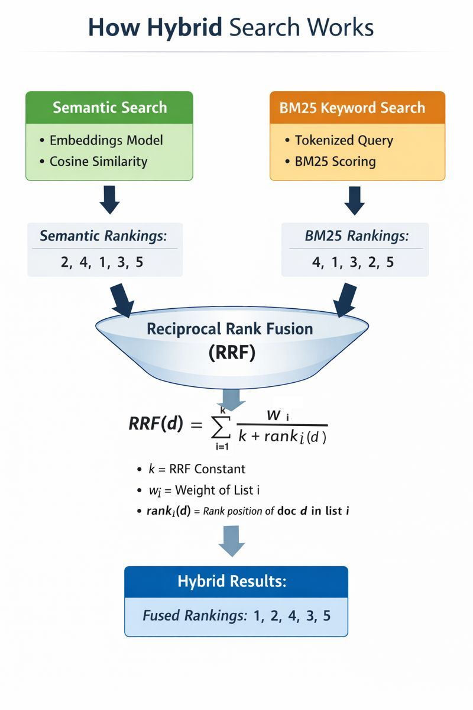

# 🔍 semantic-bm25-hybrid-search

A hybrid information retrieval demo combining **semantic vector search** and **BM25 keyword search**, fused using **Reciprocal Rank Fusion (RRF)**.  
This repository provides a clear reference implementation for modern retrieval pipelines used in RAG systems, enterprise search, and LLM routing.

---

## ✨ Features

- Semantic search using dense embeddings
- BM25 keyword-based retrieval
- Reciprocal Rank Fusion (RRF) for hybrid ranking
- Weighted fusion between semantic and lexical signals
- Simple, readable, single-file Python implementation
- No external database required (in-memory corpus)

---

## 🗂 Project Structure

```
.
├── hybrid_search_demo.py
├── images/
│   └── semantic-bm25-hybrid-search.jpeg
└── README.md
```

---

## ⚙️ Requirements

- Python **3.9+**
- Internet access (for first-time embedding model download)

### Dependencies

```
sentence-transformers
rank-bm25
numpy
```

---

## 🚀 Installation

### 1. Clone the repository

```bash
git clone https://github.com/your-username/semantic-bm25-hybrid-search.git
cd semantic-bm25-hybrid-search
```

### 2. (Recommended) Create a virtual environment

```bash
python3 -m venv venv
source venv/bin/activate    # macOS / Linux
# venv\Scripts\activate     # Windows
```

### 3. Install dependencies

```bash
pip install sentence-transformers rank-bm25 numpy
```

---

## ▶️ Usage

Basic usage:

```bash
python hybrid_search_demo.py --query "refund policy for subscription"
```

With custom parameters:

```bash
python hybrid_search_demo.py \
  --query "how do I cancel my subscription and get a refund" \
  --topk 5 \
  --rrf_k 60 \
  --semantic_weight 1.0 \
  --bm25_weight 1.0
```

---

## 🧠 How Hybrid Search Works

<p align="center">
  
</p>

The system retrieves documents using two independent strategies:

1. **Semantic Search** – captures meaning using vector embeddings and cosine similarity  
2. **BM25 Keyword Search** – captures exact lexical relevance  

Each method produces a ranked list, which is fused using **Reciprocal Rank Fusion (RRF)**.

**Reciprocal Rank Fusion (RRF):**

```
RRF(d) = Σᵢ wᵢ / (k + rankᵢ(d))
```

where:
- `k` = RRF constant (commonly 60)
- `wᵢ` = weight of ranking list *i*
- `rankᵢ(d)` = rank position of document *d* in list *i*

---

## 🧪 Use Cases

- Retrieval-Augmented Generation (RAG)
- Enterprise knowledge search
- Hybrid vector + keyword retrieval
- LLM query routing
- Search research and benchmarking

---

## 🔄 Possible Extensions

- Replace in-memory documents with **Qdrant**, **FAISS**, or **Chroma**
- Add **Relative Score Fusion (RSF)** for comparison
- Expose as a **FastAPI** service
- Add cross-encoder re-ranking
- Integrate retrieval with LLM generation

---

## 📚 References

- Cormack et al., *Reciprocal Rank Fusion*, SIGIR 2009  
- Robertson et al., *BM25 and Probabilistic Retrieval*  
- Sentence-Transformers: https://www.sbert.net  

---

## 📜 License

MIT License

---

## ⭐ Notes

This project is intentionally kept minimal to clearly demonstrate hybrid retrieval and rank fusion concepts.
